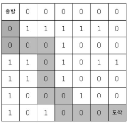

11. 미로의 최단거리 통로(BFS)
    설명

7*7 격자판 미로를 탈출하는 최단경로의 길이를 출력하는 프로그램을 작성하세요.

경로의 길이는 출발점에서 도착점까지 가는데 이동한 횟수를 의미한다.

출발점은 격자의 (1, 1) 좌표이고, 탈출 도착점은 (7, 7)좌표이다. 격자판의 1은 벽이고, 0은 도로이다.

격자판의 움직임은 상하좌우로만 움직인다. 미로가 다음과 같다면

위와 같은 경로가 최단 경로의 길이는 12이다.

입력

첫 번째 줄부터 7*7 격자의 정보가 주어집니다.

출력

첫 번째 줄에 최단으로 움직인 칸의 수를 출력한다. 도착할 수 없으면 -1를 출력한다.

예시 입력 1

0 0 0 0 0 0 0
0 1 1 1 1 1 0
0 0 0 1 0 0 0
1 1 0 1 0 1 1
1 1 0 1 0 0 0
1 0 0 0 1 0 0
1 0 1 0 0 0 0
예시 출력 1

12