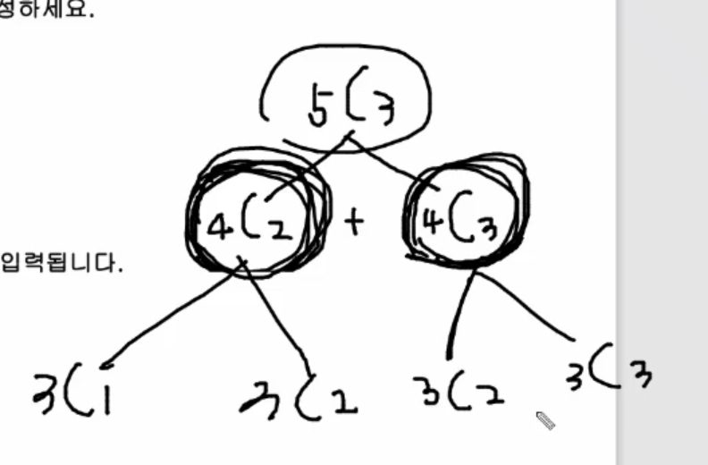
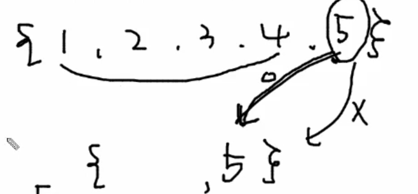

조합은 이런 그림이 나온다. (파스칼의 삼각형)

5명중에서 3명을 뽑는다고 할때 딱 두가지로 분류를 할 수 있다.

(4명중에서 2명뽑는 경우, 4명중에서 3명뽑는 경우)

**분류기준은 5번 학생을 뽑느냐 안뽑느냐로 나눌 수 있다.**

1. 4C2는 5번 학생이 뽑혔다고 볼 수 있다

2. 4C3은 5번 학생이 뽑히지 않았다고 볼 수 있다.

이런식으로 분류를 하면 5명중에서 3명을 뽑는 경우의 수는 4명중에서 2명을 뽑는 경우의 수와 4명중에서 3명을 뽑는 경우의 수를 더한 것과 같다.

이런식으로 재귀를 이용해서 구현할 수 있다.

