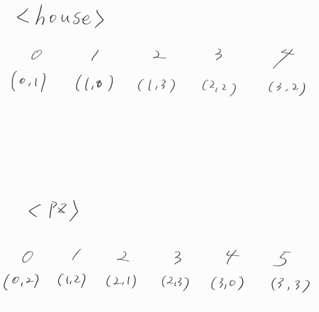
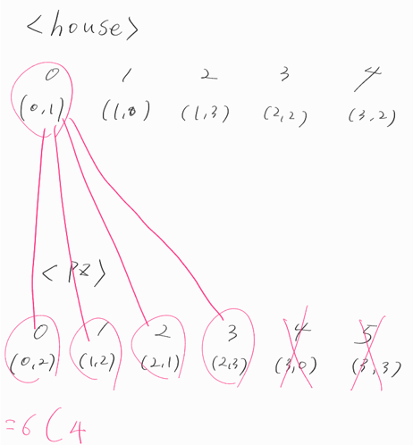

1. 전체 피자집 중에서 M개의 피자집을 선택하는 모든 조합을 구한다.(살아남은 피자집 구하기)
2. 집을 기준으로 1에서 구한 피자집 조합수로 피자배달거리를 구한다.
3. 2에서 구한 피자배달거리를 최소값으로 구해서 sum에 누적시킨다.
4. 반복한다. 집집마다 구한다. 그러면 sum에는 도시의 최소 피자 배달거리가 구해짐.

hs와 pz ArrayList에 Point좌표로 들어가면 이런 그림이 된다.

그 중 M개의 피자집 빼고 폐업을 시켜야 한다.
그럼 조합을 구해야하는데, 6C4 로 15의 값이 나온다.

combi를 출력해보면 이렇게 값이 나온다
0 1 2 3
0 1 2 4
0 1 2 5
0 1 3 4 ....
(중략)

