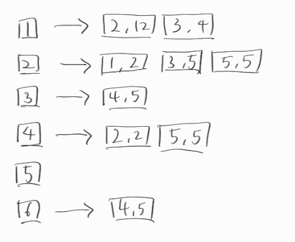
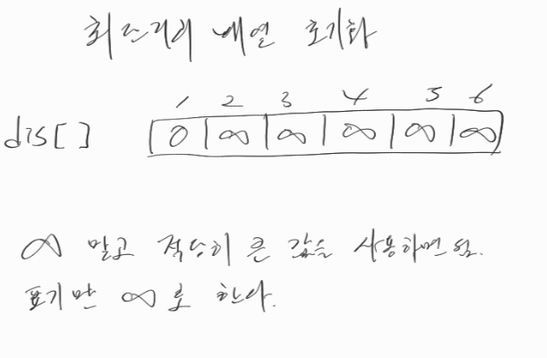
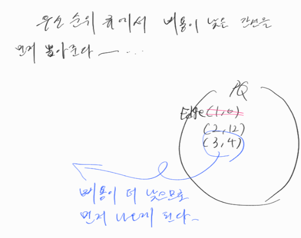

## 다익스트라 알고리즘

- 그래프에서 최단 거리를 구하는 알고리즘이다.
- 출발 노드와 모든 노드간의 최단 거리를 탐색한다.
- 에지는 모두 양수여야한다.
- 시간 복잡도 : O(ElogV)

특정노드에서 다른 노드들의 최단 거리를 구하는 문제가 나왔을때 다익스트라 알고리즘을 사용한다.

1. 인접 리스트로 그래프 구현

2. 최단거리 배열 초기화

3. 비용이 가장 작은 노드 고르기

4. 최단거리 배열 업데이트

5. 우선순위 큐가 빌 때까지 반복하여 최단거리 배열 완성하기

